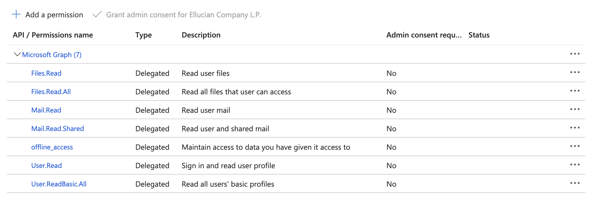

# 
Productivity Tools Extensions

Includes Google Productivity Tools (Gmail and Google Drive) and the Microsoft Productivity Tools (Outlook and One Drive) as Experience extensions.
 

# Contents
- [Google Cards](#google-cards)
- [Microsoft Cards](#microsoft-cards)
- [Two Extension, One Repository](#two-extensions)
- [Get the source](#get-the-source)
- [Google Extension](#google)
  - [Build and Upload](#google-build)
  - [Google Configuration](#google-configuration)
  - [Create Google Cloud credentials for OAuth](#google-cloud)
  - [Configure Google Cards](#configure-google-cards)
- [Microsoft Extension - build and upload](#microsoft-build)
  - [Build and Upload](#microsoft-build)
  - [Microsoft Configuration](#microsoft-configuration)
  - [Create Azure Application with OAuth](#microsoft-azure)
  - [Configure Microsoft Cards](#configure-microsoft-cards)

# Google Productivity Tools cards
The Google extension includes two cards: Gmail and Google Drive.

## Gmail card
The Gmail card in Ellucian Experience displays the 10 most recent inbox emails (both read and unread) from a user’s Gmail account. For each email, the card displays the sender’s name, subject, first line of the message, date received, and document icon (if an attachment exists). The user can click on any email in the Experience card to launch Gmail and open that email.

When a user first adds the Gmail card to their Experience Dashboard, they are prompted to sign in to grant permissions and authenticate their Google account.  A user must select the 'View your email messages and settings' box on the Google permissions window to allow Elluciancloud access to display emails on the Gmail Experience card. If the box is not checked the Gmail Experience card will continue to display the 'Permissions Requested' message along with the Sign In button. Only one account may be authenticated to the Gmail card at a time. To switch to another account, the user can sign out and then sign in with the other account.

The list of emails in the card updates automatically every 60 seconds to display any new emails.

## Google Drive card
The Google Drive card in Ellucian Experience displays the 10 most recently modified documents from a user’s Google Drive account. For each document, the card displays the document title, modified date, name of the user who last modified the document, and an icon representing the document type. The user can click on any file name in the card to launch the Google Drive web application and open the selected file.

When a user first adds the Google Drive card to their Experience Dashboard, they are prompted to sign in to grant permissions and authenticate their Google account. A user must select the 'See and download all your Google Drive files' box on the Google permissions window to allow Elluciancloud access to display the files on the Google Drive Experience card. If the box is not checked the Google Drive Experience card will continue to display the 'Permissions Requested' message along with the Sign In button.  Only one account may be authenticated to the Google Drive card at a time. To switch to another account, the user can sign out and then sign in with the other account.

The list of documents in the card updates automatically every 60 seconds to display any newly modified documents.

# Microsoft Productivity Tools cards
The Microsoft extension includes two cards: Outlook and OneDrive.

## Outlook card
The Outlook card in Ellucian Experience displays the 10 most recent inbox emails (both read and unread) from a user’s Outlook account. For each email, the card displays the sender’s profile image, name, subject, first line of the message, date received, and document icon (if an attachment exists). The user can click on any email in the Experience card to launch Outlook.

When a user first adds the Outlook card to their Experience Dashboard, they are prompted to sign in to grant permissions and authenticate their Outlook account. Only one account may be authenticated to the Outlook card at a time. To switch to another account, the user can sign out and then sign in with the other account.

The list of emails in the card updates automatically every 60 seconds to display any new emails.

## OneDrive card
The Microsoft OneDrive card in Ellucian Experience displays the 10 most recently modified documents from a user’s OneDrive account. For each document, the card displays the document title, modified date, name of the user who last modified the document, and an icon representing the document type. The user can click on any file name in the card to launch the Microsoft OneDrive web application and open the selected file.

When a user first adds the Microsoft OneDrive card to their Experience Dashboard, they are prompted to sign in to grant permissions and authenticate their Microsoft account. Only one account may be authenticated to the Microsoft OneDrive card at a time. To switch to another account, the user can sign out and then sign in with the other account.

The list of documents in the card updates automatically every 60 seconds to display any newly modified documents.

# Two extensions, One repository
To more easily share code between the two extensions, they have been combined into a single node package. This means there are departures from the standard Experience Extension npm scripts, extension.js, and webpack.config.js. There are separate Google and Microsoft versions of each.

For instance, during the development of the Google extension, use 'npm run google-start' in a terminal to run the webpack watch that builds as you make changes to the Google extension. Likewise, during the development of the Microsoft extensions, use 'npm run microsoft-start'.

To see all the npm run scripts, use 'npm run'

google-extension.js defines the Google Productivity Tools extension with its cards. microsoft-extension.js defines the Microsoft Productivity Tools extension with its cards.

Note each version of the webpack.config.js uses the appropriate extension.js. This provides separate entry points for each extension's cards.

# Get the source
Use your favorite Git tool to clone this repository.

# Google Extension
## Google Extension - build and upload
1. Obtain an upload token from Experience Setup and add that token to .env, as described in [Build and upload an extension](https://resources.elluciancloud.com/bundle/ellucian_experience_acn_use/page/t_upload_extension.html).
1. Update publisher in `google-extension.js`.
1. Run 'npm install' to install all the dependencies.
1. Run one of the deployment npm scripts, such as 'npm run google-start' (for development).
1. Enable the extension and add it to an environment(s) in Experience Setup -> Extensions, using the procedure in [Enable an extension in Experience environments](https://resources.elluciancloud.com/bundle/ellucian_experience_acn_use/page/t_enable_extension_experience_envs.html). 

## Google Configuration
The Google cards use a Google OAuth client ID to initiate an OAuth Authorization Code flow with PKCE. This is done using Google Identity's Google Sign-In for Websites [see reference](https://developers.google.com/identity/sign-in/web/reference)

The Google Client ID will be configured in Experience later.

## Create Google Cloud credentials for OAuth
### Create a project
1. Log in to Google Cloud Platform console at https://console.cloud.google.com.
1. Click on the project dropdown in the navbar and click "New Project", name appropriately, something like "Experience Test". Click "Create".
### Create an OAuth Consent
1. Click "APIs & Services", then "OAuth consent screen"
1. Select a User Type of "Internal", then click "Create."
1. Enter an App name, such as "Experience". Select a required support email and if desired the App logo.
1. Add an Authorized domain of "elluciancloud.com"
1. Add the required Developer email address, then click "SAVE AND CONTINUE".
1. In this step, you are defining what permissions this app is allowed to request. Click "ADD OR REMOVE SCOPES".
1. In the dialog near the top, there is an infobox that has a link to Google API Library. Click this link and it will open a new tab.
1. In the new tab, search for Gmail and click "Gmail API". When it opens click "Enable". Wait for it to complete, then close the tab.
1. Once more click on the "Google API Library" link, which opens in a new tab.
1. In the new tab search for Google Drive and click "Google Drive API". When it opens click "Enable". Wait for it to complete, then close the tab.
1. Now to get the newly enabled API permissions to show in the list, refresh the browser. You may have to click "SAVE AND CONTINUE" again to get to the "ADD OR REMOVE SCOPES" button. Click this again as well.
1. Now filter for gmail.readonly and select the check box next to it - Don't worry about the mislabeled API on this one. It shows Google Drive API even though this is for Gmail API.
1. Clear the filter, and then filter for drive.readonly, then select the check box for this permission.
1. Click "UPDATE", then the "SAVE AND CONTINUE" - OAuth consent is done.
### Create an OAuth Credential
1. In the left nav select "Credentials." You need to create an OAuth 2.0 Client ID. Click "CREATE CREDENTIALS" at the top and pick OAuth client ID.
1. Choose Application type of "Web application", then name it something like "Experience".
1. Add a URI to the Authorized JavaScript origins. For Test use https://experience-test.elluciancloud.com. For Prod use https://experience.elluciancloud.com.
1. Click "CREATE". You can copy the Client ID from here. Client Secret is not needed.

## Configure Google Cards
Configure the Google cards using the procedure in [Set up an extension card in an environment](https://resources.elluciancloud.com/bundle/ellucian_experience_acn_use/page/t_set_up_extension_card.html). In the Configure step of the wizard, enter the Google OAuth client ID that you created in Google. A valid Google OAuth client ID will end with '.apps.googleusercontent.com'.

The Configure step values are shared by both Google Cards because it is an extension-level setting.

# Microsoft Extension
## Microsoft Extension - build and upload
1. Obtain an upload token from Experience Setup and add that token to .env, as described in [Build and upload an extension](https://resources.elluciancloud.com/bundle/ellucian_experience_acn_use/page/t_upload_extension.html).
1. Update publisher in `microsoft-extension.js`.
1. Run 'npm install' to install all the dependencies.
1. Run one of the deployment npm scripts, such as 'npm run microsoft-start' (for development).
1. Enable the extension and add it to an environment(s) in Experience Setup -> Extensions, using the procedure in [Enable an extension in Experience environments](https://resources.elluciancloud.com/bundle/ellucian_experience_acn_use/page/t_enable_extension_experience_envs.html). 

## Microsoft Configuration
The Microsoft cards use an Azure AD Application ID to initiate an OAuth Authorization Code flow with PKCE. This is done using the Microsoft Authentication Library for JavaScript [see reference](https://github.com/AzureAD/microsoft-authentication-library-for-js#readme).

The Microsoft Azure Redirect URL, Application ID, and Tenant ID will be configured in Experience later.

## Create Azure Application with OAuth
### Follow the steps below to configure the application in Azure Active Directory:
1. Log in to the Azure portal https://portal.azure.com and select the Azure Active Directory Service.
1. Click the "App Registrations" and create a new application in the tenant of your choice.
1. Provide the name of your choice, eg. "Experience".
1. Set the Redirect URI for the Single Page Application. Set this to the Ellucian Experience Dashboard URL from the About tab in Experience Setup.
1. Click the application link you just created, and navigate to the Redirect URIs ‘spa’ link.
1. Make sure it shows the Grant Type ‘Your Redirect URI is eligible for the Authorization Code Flow with PKCE’.
1. The application has been created successfully.
### Set API Permissions
1. You are now good to add permissions for the application. Open the API permissions for the selected application.
1. Click ‘Add a permission’.
1. Click Microsoft Graph and select the delegated permissions.
1. You would now be able to add permissions by selecting the permission and click Add Permission button. Add the following permissions:
    - User.Read
    - User.ReadBasic.All
    - Mail.Read
    - Mail.Read.Shared
    - Files.Read
    - Files.Read.All
1. Copy the ClientId and TenantId for the application, and configure them in the Experience OneDrive card configuration.

    After setting the API permissions, here is how it will look:
    

        
    

## Configure Microsoft Cards
Configure the Microsoft cards using the procedure in [Set up an extension card in an environment](https://resources.elluciancloud.com/bundle/ellucian_experience_acn_use/page/t_set_up_extension_card.html). In the Configure step of the wizard, enter the Redirect URL exactly as it was entered in the Azure AD Application; the Azure AD Application ID; and Tenant ID.

The Configure step values are shared by both Microsoft Cards because it is an extension-level setting.
