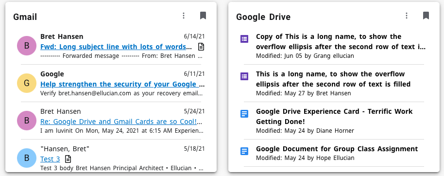
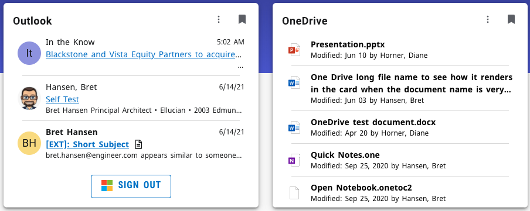

# 
Productivity Tools Extensions

Includes Google Productivity Tools and the Microsoft Productivity Tools as Experience extensions. What is [Ellucian Experience](https://www.ellucian.com/solutions/ellucian-experience)
  

# Contents
- [Google Cards](#google-cards)
- [Microsoft Cards](#microsoft-cards)
- [Two Extension, One Repository](#two-extensions)
- [Get the source](#get-the-source)
- [Google Extension - build, upload and configure](#google-build)
- [Microsoft Extension - build, upload and configure](#microsoft-build)

# Google Productivity Tools cards
The Google extension includes two cards Gmail and Google Drive.

## Gmail card

## Google Drive card
The Google Drive card in Ellucian Experience displays the 10 most recently modified documents from a user’s Google Drive account. For each document, the card displays the document title, modified date, name of the user who last modified the document, and an icon representing the document type. The user can click on any file name in the card to launch the Google Drive web application and open the selected file.

When a user first adds the Google Drive card to their Experience Dashboard, they are prompted to sign in to grant permissions and authenticate their Google account. Only one account may be authenticated to the Google Drive card at a time. To switch to another account, the user can sign out and then sign in with the other account.

The list of documents in the card updates automatically every 60 seconds to display any newly modified documents.

# Microsoft Productivity Tools cards
The Microsoft extension includes two cards Outlook and OneDrive.

## Outlook card

## OneDirve card
The Microsoft OneDrive card in Ellucian Experience displays the 10 most recently modified documents from a user’s OneDrive account. For each document, the card displays the document title, modified date, name of the user who last modified the document, and an icon representing the document type. The user can click on any file name in the card to launch the Microsoft OneDrive web application and open the selected file.

When a user first adds the Microsoft OneDrive card to their Experience Dashboard, they are prompted to sign in to grant permissions and authenticate their Microsoft account. Only one account may be authenticated to the Microsoft OneDrive card at a time. To switch to another account, the user can sign out and then sign in with the other account.

The list of documents in the card updates automatically every 60 seconds to display any newly modified documents.

# Two extensions, One repository
To more easily share code between the two extensions, they have been combined into a single node package. This means there are departures from the standard Experience Extension npm scripts, extension.js, and webpack.config.js. There are separate Google and Microsoft version of each.

For instance, during development of the Google extension, use 'npm run google-start' in a terminal to run the webpack watch that builds as you make changes to the Google extension. Likewise during development of the Microsoft extensions use 'npm run microsoft-start'.

To see all the npm run scripts, use 'npm run'

google-extension.js defines the Google Productivity Tools extension with its cards.
microsoft-extension.js defines the Microsoft Productivity Tools extension with its cards.

Note each version of the webpack.config.js uses the appropriate extension.js. This provides the separate entry points for each extension's cards.

# Get the source
Use your favorite Git tool to clone this repository.

# Google Extension - build, upload and configure

1. Obtain an upload token from Experience Setup. See Experience documentation - [Explore the SDK sample content](https://resources.elluciancloud.com/bundle/ellucian_experience_acn_use/page/t_explore_sdk_sample_content.html)
2. Add the upload token to .env. See sample.env in package root.
3. Run 'npm install' to install all the dependencies.
4. Run one a deployment npm scripts, such as 'npm run google-start' (for development)
5. Enable the extension and add it to an environment(s) in [Experience Setup -> Extensions](https://experiencesetup-test.elluciancloud.com/extensions)
6. Configure the cards in the Dashboard -> Configuration -> Card Management. Adding the Google OAuth Client ID in step 3. Details below.

# Google Configuration
The Google cards use a Google OAuth client ID to initiate an OAuth Authorization Code flow with PKCE. This is done using Google Identity's Google Sign-In for Websites [see reference](https://developers.google.com/identity/sign-in/web/reference)

The Google OAuth client ID needs to be added by using Experience -> Configuration -> Card Management. Each card will need to be configured to add the required 'Card tags', chose role(s) and to add the OAuth client ID. The OAuth client ID is on step three of the card configuration wizard. A valid Google OAuth client ID will end with '.apps.googleusercontent.com'.

## Creating an Google Cloud API credentials for OAuth
details coming

# Microsoft Extension - build, upload and configure

1. Obtain an upload token from Experience Setup. See Experience documentation - [Explore the SDK sample content](https://resources.elluciancloud.com/bundle/ellucian_experience_acn_use/page/t_explore_sdk_sample_content.html)
2. Add the upload token to .env. See sample.env in package root.
3. Run 'npm install' to install all the dependencies.
4. Run one a deployment npm scripts, such as 'npm run google-start' (for development)
5. Enable the extension and add it to an environment(s) in [Experience Setup -> Extensions](https://experiencesetup-test.elluciancloud.com/extensions)
6. Configure the cards in the Dashboard -> Configuration -> Card Management. Adding the Azure Redirect URL, Applciation ID, and Tenant ID in step 3. Details below.

## Microsoft Configuration
The Microsoft cards use a Azure AD Application ID to initiate an OAuth Authorization Code flow with PKCE. This is done using the Microsoft Authentication Library for js [see reference](https://github.com/AzureAD/microsoft-authentication-library-for-js#readme)

The Microsoft Azure Redirect URL, Applciation ID, and Tenant ID need to be added by using Experience -> Configuration -> Card Management. Each card will need to be configured to add the required 'Card tags', chose role(s) and to add the URL and IDs. The URL and IDs are entered on step three of the card configuration wizard.

## Creating an Azure Application with OAuth
details coming