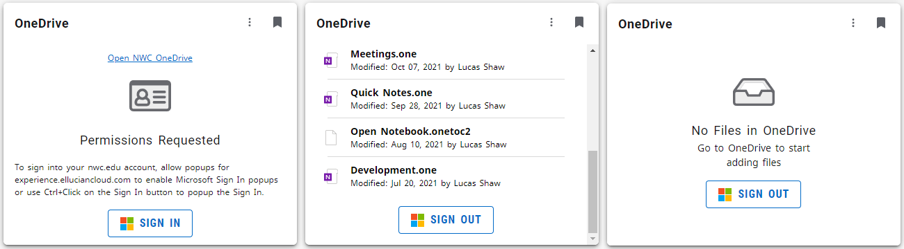

# W75 Microsoft Cards Notes
This fork includes a W75 version of the Microsoft Outlook Card, Microsoft OneDrive Card, and a prototype Microsoft Outlook Calendar Agenda Card.  See descriptions below for details about the changes or features of each of the cards.  Please find build notes/deployment advice below for the entire set of cards (each card as instructions on how to build each individual card separately if so desired).

## Modifications Required to Enable W75 Version of the W75 Microsoft Cards
1.  To enable the  W75 packaging, you will need to backup your `package.json` and replace it with the W75 version (e.g. rename `package.json` to `package_orig.json` and copy `w75_package.json` to `package.json`).  This allows you to use the '`npm run`' commands `w75_microsoft-build-dev`, `w75_microsoft-build-prod`, `w75_microsoft-deploy-dev`, `w75_microsoft-deploy-prod`, and `w75_microsoft-start` to build all of the W75 Microsoft Cards with the w75 code base.  You can use `w75_outlook-start` to build only the Outlook Card, `w75_calendar-start` to build onlye the Outlook Calendar Card, or `w75_onedrive-start` to build only the OneDrive card.
 <i>Note: When you use the separate OneDrive and Outlook targets, the OneDrive Card will lose the two custom parameters used by the Outlook Card since it does not use them.</i>
2. The following code files need to be used instead of the originals (rename the originals, then copy the w75 version with the appropriate name):
    `src\i18n\w75_en.json`  - This contains additions and changes to the original `en.json` that are used by the w75 version.
3.  Add the `OUTLOOK_MAX_MESSAGE_COUNT` and `OUTLOOK_FETCH_UNREAD_ONLY` variables to your `.env` file and configure them as desired (defaults can be found in the `w75_sample.env`).  The defaults are 10 for `OUTLOOK_MAX_MESSAGE_COUNT` and true for `OUTLOOK_FETCH_UNREAD_ONLY` respectively.
4.  Change `w75_microsoft-extension.js` and replace the publisher of "`Your Institution`" with your institution name and in the card information (`title` and `description`), replace `{Institution Acronym}` with your institution's acronym - e.g. replace Your Institution with `My College` and replace `{Institution Acronym}` with `MyC`.  Optionally, change the card `type` to `{YOURINSTCODE}_OutlookCard` (use your institution code (`X##`) instead of `W75`).
5.  As part of implementing this project, we brought it up to the current Ellucian SDK version (SDK `v5.7.0` and Path Design `v6.4.0` (early as `v6.3.0` is currently recommended) as of the writing of this document).  We also updated several modules (including the Microsoft Graph API related modules, eslint, webpack, and other) to their latest supported versions.  Please compare the package.json from the v1.3 build to the one in this fork to see all of the changes.  This was to make sure that we were using the most recent version of `moment.js` in particular for the date and time formatting support. 

Execute '`npm install`' to update the dependency libraries to the current versions.  Upgrade `core-js` with the following command (recommended in the npm install output: `node -e "try{require('./postinstall')}catch(e){}"`

You may need to remove your `package-lock.json` if you have issues with it when building the project.  You can also delete your `node_modules` directory to start a clean build.

### Package Version Updates:
Several packages were updated in the package.json to their latest applicable versions as of the writing of this document:

Dependencies were changed as such:
- Modifications to `dependencies`:
    - Upgraded `@azure/msal-browser` from `2.14.2` to `2.26.0`
    - Upgraded `@microsoft/mgt-components` upgraded from `2.26.0` to `2.5.2`
    - Added `moment` version `2.29.3` (a lesser version was a peer to one dependency)
    - Upgraded `react-intl` from `2.8.0` to `5.25.1` (also changed the code for `components\ReactIntlProviderWrapper.jsx` and `i18n\intlUtilty.js` to those used by the Ellucian SDK Examples for `Experience SDK v5.7.0`)
    - Upgraded `sanitize-html` from `2.4.0` to `2.7.0`

Dev dependencies also changed:
 - Modifications to `devDependencies`:
    - Upgraded `@ellucian/ds-icons` from `5.1.0` to `6.4.0`
    - Upgraded `@ellucian/experience-extension` from `3.1.0` to `5.7.0`
    - Upgraded `@ellucian/react-design-system` from `5.1.0` to `6.4.0`
    - Upgraded `@babel/eslint-parser` from `7.12.1` to `7.18.2`
    - Upgraded `@babel/plugin-transform-runtime` from `17.12.1` to `7.18.6`
    - Upgraded `@babel/preset-env` from `17.12.1` to `7.18.6`
    - Upgraded `@babel/preset-react` from `17.12.1` to `7.18.6`
    - Upgraded `cross-env` from `7.0.2` to `7.0.3`
    - Upgraded `dotenv-webpack` from `7.0.2` to `7.1.1`
    - Upgraded `enzyme-adapter-react-16` from `1.15.5` to `1.15.6`
    - Upgraded `eslint` from `7.27.0` to `8.18.0`
    - Upgraded `eslint-plugin-import` from `2.23.3` to `2.26.0`
    - Upgraded `eslint-plugin-jest` from `24.1.0` to `26.5.3`
    - Upgraded `eslint-plugin-jsx-a11y` from `6.4.1` to `6.6.0`
    - Upgraded `eslint-plugin-react` from `7.21.5` to `7.30.1"`
    - Upgraded `jest` from `26.5.3` to `28.1.2`
    - Upgraded `jest-junit` from `12.0.0` to `14.0.0`
    - Upgraded `webpack` from `5.4.0` to `5.73.0`
    - Upgraded `webpack-cli` from `4.2.0` to `4.10.0`
    - Upgraded `expect` from `26.6.2` to `28.1.1`

## Compiling/Deploying the W75 Microsoft Cards
Once the above changes are in place, make sure your .env file is configured correctly for your target environment(s) and execute '`npm run w75_microsoft-start`' from the terminal in VS Code (or your commandline window) to start the continuous build-deploy mode or '`npm run w75_microsoft-build-{prod|dev}`' and '`npm run w75_microsoft-deploy-{prod|dev}`' to do a single build/deploy (e.g. execute '`npm run w75_microsoft-build-dev`' and then execute '`npm run w75_microsoft-deploy-dev`'). NOTE: when using '`npm run w75_microsoft-start`', you will need to kill the loop (e.g. with `Ctrl+C` then enter '`Y`' to terminate the batch job) and restart it if you make changes to the `.env` file.

# W75 Microsoft Outlook Card Notes
This fork includes a W75 version of the Microsoft Outlook Card that includes enhancements to allow Experience developers to configure the Outlook Card to have a number of items other than 10 returned to the card (currently using the `OUTLOOK_MAX_MESSAGE_COUNT` variable in the .env file), and also whether or not to render only unread messages (using the `OUTLOOK_FETCH_UNREAD_ONLY` variable in the .env file).  Both of these also have a stub for an Experience configuration variable that can be set in Experience, but it is currently unused.  These changes also include the addition of a count of unread messages (from a second Microsoft Graph API call to the Inbox folder) in the `Mail` view and a link to the inbox for the `NoEmail` view.  The Login view of the card was updated to remind users to allow pop-ups for the Experience site and also to provide a direct link to the outlook inbox if they are having issues with popups.  This link and the inbox link from the logged in view was changed to use an internationalized string for the URL so it is configurable with the internationalization (i18n) subsystem.

Code for the W75 Microsoft Outlook Card has a `w75_` prefix, and can be used from the w75 enhanced build scripts in the project without changes with the following exceptions:

`package.json` is a copy of the 75_package.json if you check it out directly from this project.

## Modifications Required to Enable W75 Version of the Microsoft Outlook Card
1. To enable the  W75 packaging, you will need to backup your `package.json` and replace it with the W75 version (e.g. rename `package.json` to `package_orig.json` and copy `w75_package.json` to `package.json`).  This allows you to use the '`npm run`' commands `w75_microsoft-build-dev`, `w75_microsoft-build-prod`, `w75_microsoft-deploy-dev`, `w75_microsoft-deploy-prod`, and `w75_microsoft-start` to build both the Outlook and OneDrive Cards with the w75 code base.  You can use `w75_outlook-start` to build only the Outlook Card or `w75_onedrive-start` to build only the OneDrive card.  When you use the separate OneDrive and Outlook targets, the OneDrive Card will lose the two custom parameters used by the Outlook Card since it does not use them.
2. The following code files need to be used instead of the originals (rename the originals, then copy the w75 version with the appropriate name):
    `src\i18n\w75_en.json`  - This contains additions and changes to the original `en.json` that are used by the w75 version.
3. Add the `OUTLOOK_MAX_MESSAGE_COUNT` and `OUTLOOK_FETCH_UNREAD_ONLY` variables to your `.env` file and configure them as desired (defaults can be found in the `w75_sample.env`).  The defaults are 10 for `OUTLOOK_MAX_MESSAGE_COUNT` and true for `OUTLOOK_FETCH_UNREAD_ONLY` respectively.
4. Change w75_microsoft-extension.js and replace the publisher of "`Your Institution`" with your institution name and in the card information (`title` and `description`), replace `{Institution Acronym}` with your institution's acronym - e.g. replace Your Institution with `My College` and replace `{Institution Acronym}` with `MyC`.  Optionally, change the card `type` to `{YOURINSTCODE}_OutlookCard` (use your institution code (`W##`) instead of `W75`).

## Building the W75 Version of the Microsoft Outlook Card
Once the above changes are in place, make sure your `.env` file is configured correctly for your target environment(s) and execute '`npm run w75_outlook-start`' (for just the W75 Outlook Card) or  '`npm run w75_microsoft-start`' (for all W75 Microsoft Cards) from the terminal in VS Code (or your commandline window) to start the continuous build-deploy mode or '`npm run w75_microsoft-build-{prod|dev}`' and '`npm run w75_microsoft-deploy-{prod|dev}`' to do a single build/deploy (e.g. execute '`npm run w75_microsoft-build-dev`' and then execute '`npm run w75_microsoft-deploy-dev`'). NOTE: when using '`npm run w75_microsoft-start`', you will need to kill the loop (e.g. with `Ctrl+C` then enter '`Y`' to terminate the batch job) and restart it if you make changes to the `.env` file.

# W75 Microsoft OneDrive Card Notes
This fork includes a W75 version of the Microsoft OneDrive Card that customizes the message on the login view to include information about allowing pop-ups or trying to Ctrl+Click on the Sign In button.  Like the W75 Microsoft Outlook Card, this card has its own npm build targets

## Building the W75 Version of the Microsoft OneDrive Card
Once the above changes are in place, make sure your `.env` file is configured correctly for your target environment(s) and execute '`npm run w75_onedrive-start`' (for just the W75 OneDrive Card) or  '`npm run w75_microsoft-start`' (for all W75 Microsoft Cards) from the terminal in VS Code (or your commandline window) to start the continuous build-deploy mode or '`npm run w75_microsoft-build-{prod|dev}`' and '`npm run w75_microsoft-deploy-{prod|dev}`' to do a single build/deploy (e.g. execute '`npm run w75_microsoft-build-dev`' and then execute '`npm run w75_microsoft-deploy-dev`'). NOTE: when using '`npm run w75_microsoft-start`', you will need to kill the loop (e.g. with `Ctrl+C` then enter '`Y`' to terminate the batch job) and restart it if you make changes to the `.env` file.

# W75 Microsoft Outlook Calendar Card Notes
This fork includes a prototype Calendar element that uses the Microsoft Graph API (using a similar codebase as the Microsoft Outlook Card) to retrieve calendar events from the user's calendar for the next 7 days starting at midnight of the current day and display them in a list format.  Each event is linked to the URL of the event on the Outlook Calendar so the user may read the full body of the event and click any embedded links to online meetings.  The link makes use of the OUTLOOK_USE_WEB_LINK parameter The color scheme is based on the NWC Red color (HTML Color #A71000), where Accepted events (accepted or events where the user is the orgainizer) are highlighted in NWC Red, and Tentatively Accepted Events are highlighted in 18% lighter version of NWC Red (HTML Color #C7665C), while events that have not been accepted or are in a different status than Accepted (or Organizer) or Tentatively Accepted are highlighted with 36% lighter version of NWC Red (HTML Color #E6BCB8).  The 18% color difference stems from the observation that the 600 and 500 versions of the colors in the Ellucian Path Design System are 18% lighter (e.g. using [ShadowLord](https://noeldelgado.github.io/shadowlord/#a71000) with 18% differential).

## Additional Azure AD Application API Permissions Required
The following permissions must be added to the Azure API Application Permissions to enable the W75 Calendar Card to gather your agenda.

- Calendar.Read
- Calendar.Read.Shared

Add these in addition to the ones specified in the [README.md](README.md).

## Building the W75 Version of the Microsoft Outlook Calendar Card
Once the above changes are in place, make sure your `.env` file is configured correctly for your target environment(s) and execute '`npm run w75_calendar-start`' (for just the W75 Outlook Calendar Card) or  '`npm run w75_microsoft-start`' (for all W75 Microsoft Cards) from the terminal in VS Code (or your commandline window) to start the continuous build-deploy mode or '`npm run w75_microsoft-build-{prod|dev}`' and '`npm run w75_microsoft-deploy-{prod|dev}`' to do a single build/deploy (e.g. execute '`npm run w75_microsoft-build-dev`' and then execute '`npm run w75_microsoft-deploy-dev`'). NOTE: when using '`npm run w75_microsoft-start`', you will need to kill the loop (e.g. with `Ctrl+C` then enter '`Y`' to terminate the batch job) and restart it if you make changes to the `.env` file.

