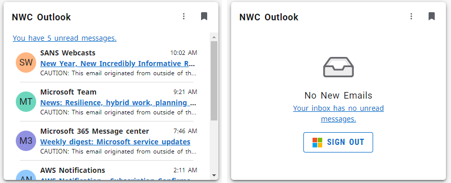

# W75 Microsoft Outlook Card Notes
This fork includes a W75 version of the Microsoft Outlook Card that includes enhancements to allow Experience developers to configure the Outlook Card to have a number of items other than 10 returned to the card (currently using the `OUTLOOK_MAX_MESSAGE_COUNT` variable in the .env file), and also whether or not to render only unread messages (using the `OUTLOOK_FETCH_UNREAD_ONLY` variable in the .env file).  Both of these also have a stub for an Experience configuration variable that can be set in Experience, but it is currently unused.  These changes also include the addition of a count of unread messages (from a second Microsoft Graph API call to the Inbox folder) in the `Mail` view and a link to the inbox for the `NoEmail` view.  

Code for the W75 Microsoft Outlook Card has a `w75_` prefix, and can be used from the w75 enhanced build scripts in the project without changes with the following exceptions:

## Modifications Required to Enable W75 Version of the Microsoft Outlook Card
1. To enable the  W75 packaging, you will need to backup your `package.json` and replace it with the W75 version (e.g. rename `package.json` to `package_orig.json` and copy `w75_package.json` to `package.json`).  This allows you to use the '`npm run`' commands `w75_microsoft-build-dev`, `w75_microsoft-build-prod`, `w75_microsoft-deploy-dev`, `w75_microsoft-deploy-prod`, and `w75_microsoft-start` to build only the Outlook Card with the w75 code base.
2. The following code files need to be used instead of the originals (rename the originals, then copy the w75 version with the appropriate name):
    `src\i18n\w75_en.json`  - This contains additions and changes to the original `en.json` that are used by the w75 version.
3. Add the `OUTLOOK_MAX_MESSAGE_COUNT` and `OUTLOOK_FETCH_UNREAD_ONLY` variables to your `.env` file and configure them as desired (defaults can be found in the `w75_sample.env`).  The defaults are 10 for `OUTLOOK_MAX_MESSAGE_COUNT` and true for `OUTLOOK_FETCH_UNREAD_ONLY` respectively.
4. Change w75_microsoft-extension.js and replace the publisher of "`Your Institution`" with your institution name and in the card information (`title` and `description`), replace `{Institution Acronym}` with your institution's acronym - e.g. replace Your Institution with `My College` and replace `{Institution Acronym}` with `MyC`.  Optionally, change the card `type` to `{YOURINSTCODE}_OutlookCard` (use your institution code (`W##`) instead of `W75`).

## Building the W75 Version of the Microsoft Outlook Card
Once the above changes are in place, make sure your .env file is configured correctly for your target environment(s) and execute '`npm run w75_microsoft-start`' from the terminal in VS Code (or your commandline window) to start the continuous build-deploy mode or '`npm run w75_microsoft-build-{prod|dev}`' and '`npm run w75_microsoft-deploy-{prod|dev}`' to do a single build/deploy (e.g. execute '`npm run w75_microsoft-build-dev`' and then execute '`npm run w75_microsoft-deploy-dev`'). NOTE: when using '`npm run w75_microsoft-start`', you will need to kill the loop (e.g. with `Ctrl+C` then enter '`Y`' to terminate the batch job) and restart it if you make changes to the `.env` file.

